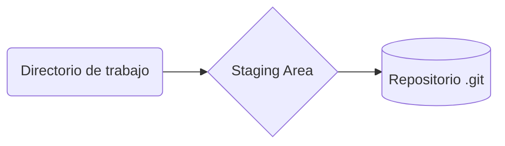

# Curso Profesional de Git y GitHub

## 1. Que es Git

Git es un sistema de control de versiones.

### Git

- Funciona de manera local

### GitHub

- Funciona en la nube
- Red social de código

Git y GitHub se puede usar en cualquier proyecto colaborativo, no solo para proyectos de código.

## 2. Porque usar un sistema de control de versiones como Git

Nos permite guardar los cambios de un proyecto:

- Quién lo hizo
- Donde ocurrieron
- Cuando ocurrieron

`Git` fue creado por la fundación Linux, específicamente por **Linus Tolvadrs**.

Solo guarda la parte donde se hizo los cambios.

### Comandos mas usados en Git

```bash
git init #Inicia el repositorio en determinada carpeta
git add file.extension #Agrega el archivo a git
git commit -m 'message' #Envia los cambios a la base de datos, debe llevar un mensaje
git add . #Agrega todos los archivos donde hubo cambios
git status #Nos muestra el estado de cambios
git show #Muestra cambios históricos hechos
git log file.extension #Historia de un archivo específico
git log #Historia del repositorio
```

## 3. Instalación de Git y GitBash en Windows

1. Descargar Git desde [git-scm.com](git-scm.com)
2. Instalar siguiente los pasos por defecto
3. Asegurarse de instalar GitBash

## 4. Instalación de Git en OSX

- Descargar Git desde [git-scm.com](git-scm.com)

## 5. Instalando Git en Linux

Se debe agregar `sudo` para ejecutar como administrador.

```bash
sudo apt-get install git
```

## 6. Editores de código, archivos binarios y texto plano

### Tipos de archivos

- **Binarios**: Difícil de entender, no es texto plano
- **Texto Plano**: Fáciles de leer en cualquier editor de texto como el bloc de notas.
- **RTF**: Texto plano difícil de leer.

### Editores de texto

- **VS Code**: Recomendado, tiene muchos plugins
- Sublime Text
- Atom
- Notepad++
- y otros mas.

## 7. Introducción a la terminal y línea de comandos

Existen varios códigos útiles para trabajar desde la línea de comandos:

### Ver el contenido de un archivo de texto plano

```bash
#cat, para ver el contenido de un archivo
cat file.extension
```

### Cambiar de directorio

```bash
#cd, change directory
cd ~ #Para ir a /home/username
cd / #Para ir a la carpeta raiz
cd .. #ir a una carpeta superior
cd . #Indica la misma carpeta donde se trabaja
```

Usar la tecla `Tab` o tabulador para autocompletar comandos, por ejemplo si estamos en un directorio donde hay una carpeta /home, al escribir **cd + 'h'** y presionar el tabulador, el comando se autocompleta a `cd home`.

### Limpiar la consola

- Comando: `clear`
- Presionar `Control + L`, limpia la consola corriendo el contenido hacia arriba

### Ayuda sobre un comando

Para obtener ayuda de un determinado comando tipear `comand --help`. Por ejemplo si queremos obtener ayuda para el comando `cd`, escribimos `cd --help` y se nos mostrará la ayuda para dicho comando.

### Navegar por los comandos

Usando las flechas **arriba** y **abajo** del teclado nos ayuda a navegar por los comandos recientes.

### Historia de los comandos

`history`: Muestra un historial de comandos, asociado a un ID.

`!id_command`: Ejecuta el comando según su ID

### Listar el contenido de un directorio

```bash
ls #Muestra carpetas y archivos de la carpeta donde estamos (list)
ls -a #Muestra contenido incluido ocultos
ls -al #Muestra una lista del contenido, incluido ocultos
ls -l #Muestra una lista del contenido de la carpeta
```

### Crear carpetas

Comando: `mkdir` proviene de **Make Directory**.

Para crear una carpeta home usaríamos `mkdir home`

### Crear archivos

Comando: `touch`

Para crear un archivo usar: `touch file.extension`

### Eliminar archivos y carpetas

- Tener cuidado ya que el borrado es inmediato
- :warning: Podría borrar todo el disco duro

Para borrar un archivo usar: `rm file.extension`

Para borrar carpetas usar: `rm -r folder`, donde **r** nos indica un borrado recursivo, es decir nos pide confirmar el borrado de algún archivo dentro de la carpeta.

### Ver la ruta actual

Para ver la ruta actual donde estamos usar: `pwd`

## 8. Crear repositorio y hacer commit

### Comandos para crear repositorio

```bash
git ini #Crea un repositorio en la ruta actual
git add file #Agrega un archivo
git add . #Agrega todos los archivos donde hubo cambios en la carpeta
git status #Muestra el estado de los archivos
git rm --cached file #Quita un archivo de la lista de archivos guardados con el commit
```

### Configuración de Git

```bash
git config #Muestra como hacer la configuración de git
git config --list #Ver configuración por defecto de git local
git config --list --show-origin #Muestra la ruta de las configuraciones guardadas
git config --global #Configuración global

#Establecer usuario
git config --global user.name 'username'

#Establecer email de usuario
git config --global user.email 'user@email'
```

### Ver historial de cambios

```bash
git log #Historial de cambios del repositorio
git log filename #Ver historial de cambios del archivo 'filename'
```

## 9. Que es un Branch y como funciona Merge en Git

### Ramas de un repositorio

La rama principal y que se crea por defecto es la rama **master**.

Durante el trabajo con Git se pueden crear mas ramas:

- Las ramas (*branchs*) son copias del master
- Puede ser de la versión actual o la versión anterior
- Al final el **branch** se puede unir a la rama **master** mediante un `merge`
- Se usan para corregir bugs o hacer cambios experimentales en un proyecto.
- Pueden tener un nombre independiente

### Flujo estándar de desarrollo

Durante el desarrollo podemos encontrar ramas que por convención reciben diferentes nombres según su objetivo: **master**, **development** y **HotFix**.

- **Master:** rama principal, va a producción
- **Development:** rama para nuevas características, nuevos features, experimentos, etc. Cuando están listos se unen al **master**.
- **HotFix:** rama para solucionar issues o errores urgentes.

### Tener en cuenta al crear ramas o branchs

- Se pueden crear las ramas y commits que se requieran
- Se pueden crear ramas con versiones anteriores
- Al hacer **merge** se pueden generar conflictos
- **checkout**, es cuando se crea una nueva rama
- **merge**, proceso de unir dos ramas

## 10. Analizar cambios en los archivos de un proyecto con Git

`git show filename` : Muestra los cambios que se dieron en un archivo 'filename'

`git diff id-A id-B`: comparar dos versiones de un repositorio con su id de commit, obtenido mediante `git log`.

## 11. Stagins y repositorios, ciclo básico de trabajo



### Directorio de trabajo

Para crear un repositorio debemos estar ubicados en el directorio de trabajo.

- Al usar `git init` se crea el **Staging Area** y el **Repositorio .git** del proyecto.
- Tendremos archivos **Unstaged** (but tracked)
- Tendremos archivos **Untracked**, es decir nunca han sido afectados por `git add`

Para eliminar archivos en git usamos `git rm`, el cual necesita argumentos.

- `git rm --cached`: Vuelve los archivos indicados a estado **Untracked**
- `git rm --force`: Elimina los archivos de git y del disco duro.

### Staging Area

- Funciona en la Memoria RAM
- `git add`, pasa un archivo al **staging area**. Es decir los archivos pasan desde un estado **Untracked** o **Unstaged** hacia un estado **Staged**.
- `git add -A`, para agregar todos los archivos a **Staged**.
- `git reset HEAD`, devuelve los archivos a su estado anterior.

### Repositorio

- Se encuentra en la carpet **.git**, que se crea al usar `git init`.
- `git commit -m 'message'`, envía los archivos al repositorio.
- Los archivos pasan a un estado de **Tracked**.

### Ver el estado de los archivos

- `git status`, nos permite ver el estado de los archivos, es decir si están **Untracked**, **Unstaged**, **Staged** o **Tracked**.

## 12. Volver en el tiempo: reset y checkout

`git log`

- Nos permite ver los diferentes commits
- Cada commit tiene un código

`git reset`

- Volver a una versión anterior, borra cambios hechos después de esa versión
- No se puede deshacer, los cambios se borran totalmente
- Estructura `git reset commit-ID --typeOfReset`
  - *commit-ID* es el ID del commit al que queremos dar reset
  - *--typeOfReset* es el tipo de *reset*
  - Ejemplo: `git reset a23kda2313281233 --hard`
  - Se debe tener precaución al momento de usarlo

`git diff`

- Nos muestra la diferencia entre dos archivos

`git log --stat`

- Muestra los detalles de los cambios durante los commits
- Salir de la pantalla presionando '**q**'

`git checkout`

- Sirve para traer versiones de archivos antiguas y poder modificarlas, incluso todo el proyecto
- Estructura: `git checkout commit-ID response`
  - *commit-ID*, el ID del commit a revisar, se obtiene usando `git log`
  - *response*, archivo que se revisará en una versión antigua
- Ejemplo: `git checkout a23kd4232312kj3k233 index.html`
  - Trae una versión anterior de *index.html*
  - Este cambio se refleja en *git status*
  - Se puede hacer *commit*, que guardará la antigua versión, sin modificar los archivos del **master** o **main**
  - Se puede hacer cambios en el archivo antiguo
    - Se hace el cambio y se agrega con *git add index.html*
    - Se hace *commit*, solo se modificará el archivo *index.html*
  - **También se puede restaurar** usando `git checkout master index.html`
    - Nos muestra nuevamente el index.html actual
    - En el *git status* ya no se muestra ningún cambio

`git reset` y `git checkout`

- Ambos nos permiten viajar en el tiempo
- `git reset` borra totalmente los cambios después del commit objetivo
- `git checkout` no borra los cambios posteriores, permite modificar ciertos cambios específicos sin perder la versión antigua.

## 13. git reset vs git rm

`git rm`

- Elimina archivos de *git* **sin eliminar su historial**
- `git rm --cached`, elimina los archivos del **staging area**, pero los mantiene en el disco duro
- `git rm --force`, elimina los archivos de *git* y del *disco duro*, es posible recuperarlos accediendo a los registros de *git*

`git reset`

- Nos permite viajar en el tiempo, al pasado, si poder volver al presente
- Borra la historia y la debemos sobre escribir, no hay vuelta atrás
- `git reset --hard`, borra toda la información incluida la de **staging area**
  - Borra todo para siempre
  - Se debe indicar el ID de la versión a la que queremos ir
  - Ejemplo: `git reset 21343245k2345 --hard`
- `git reset soft`, borra toda la información, excepto lo que está en el **staging area**
  - Se puede aplicar actualizaciones que quedan en el *staging area* en un nuevo *commit*
- `git reset HEAD`, solo quita los archivos del **staging area** para que los últimos cambios no se envíen al *commit*

`git checkout`

- Permite viajar en el tiempo: **ir, mirar, pasear y volver**

## 14. Flujo de trabajo básico con repositorio remoto


